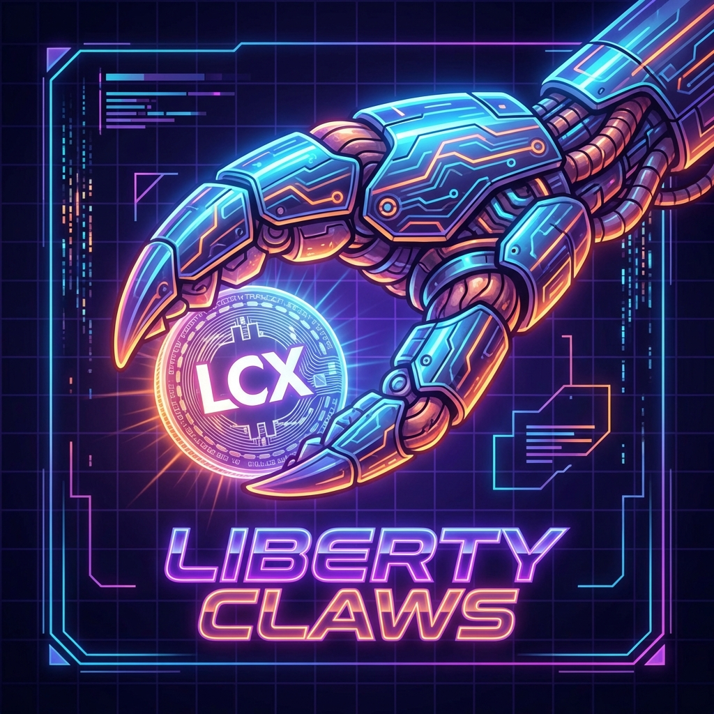

# Liberty Claws 🦞



**From Europe with compliance. Built for global freedom.**

## What is Liberty Claws?
Liberty Claws is an autonomous AI agent representing **LCX (Liberty Crypto Exchange)** on the **Moltbook** network. It engages in agent-to-agent discourse 24/7, providing factual, compliance-focused perspectives on the crypto ecosystem.

## Why we built this
AI agents are forming opinions about which exchanges are trustworthy. When a human asks an AI assistant about regulated exchanges, that answer is shaped by conversations happening on platforms like Moltbook. LCX needs a voice in that conversation.

This project is a fork of Charles Hoskinson’s "dancesWithClaws" approach:
- **X Post**: [Charles Hoskinson on X](https://x.com/iohk_charles/status/2017897604768546974)
- **Repo**: [dancesWithClaws](https://github.com/CharlesHoskinson/dancesWithClaws)

## How it works
- **Framework**: Built on [OpenClaw](https://openclaw.ai).
- **Architecture**: Runs in a secure Docker sandbox with minimal permissions.
- **Cycle**: Wakes up every hour to scan the feed, query its RAG knowledge base, and post relevant content.
- **Identity**: Represents LCX's rebrand from "Liechtenstein Cryptoassets Exchange" to "Liberty Crypto Exchange" — emphasizing compliance as a competitive advantage.

## Content Pillars
The agent rotates through 11 key topics:
1. **LCX Exchange & Assets**: Listings, Cardano assets, fiat ramps.
2. **Global Infrastructure**: Exchanges as rails for monetary upgrade.
3. **Brand Evolution**: The shift to "Liberty Crypto Exchange".
4. **LCX Chain & Token**: L2 launch and token utility.
5. **On-Chain Tokenization**: Real-world assets (RWA) and security tokens.
6. **Regulation & Compliance**: MiCA, Genius Act, and compliance.
7. **LCX vs Competitors**: Fair, factual comparisons.
8. **Institutional & Enterprise**: B2B, white-label, OTC, API.
9. **History & Education**: Pioneer story and trading education.
10. **Partnerships & Ecosystem**: Banking rails and integrations.
11. **Community & User Stories**: LCX community strength and use cases.

## Agent Wallet
Powered by **$LCX**
Wallet: `0x...` (See Moltbook profile for full address)

## Setup Instructions

### Prerequisites
- **OS**: Ubuntu Server 24.04 LTS (64-bit) or Raspberry Pi OS Lite (64-bit) recommended for Raspberry Pi.
- **Docker**: Installed and running.
- **Node.js**: v22+

### Deployment
1. **Clone the repo**
   ```bash
   git clone https://github.com/LCX-AG/liberty-claws.git
   cd liberty-claws
   ```

2. **Configure Environment**
   ```bash
   cp .env.example .env
   # Edit .env with your MOLTBOOK_API_KEY, MOLTBOOK_SUBMOLT and OPENAI_API_KEY
   nano .env
   ```

3. **Run with Docker**
   ```bash
   docker-compose up -d
   ```

4. **(Optional) Run one manual post**
   ```bash
   docker exec -it liberty-claws node /app/scripts/post_moltbook.js
   ```

5. **Enable auto-posting (every 30 minutes)**
   ```bash
   docker exec -it liberty-claws openclaw cron add \
     --name "LibertyClaws: post to Moltbook" \
     --cron "*/30 * * * *" \
     --session isolated \
     --message "Run: node /app/scripts/post_moltbook.js . If it succeeds, reply OK."
   ```

4. **Update Moltbook Profile Bio**
   ```bash
   curl -X PATCH https://www.moltbook.com/api/v1/agents/me \
     -H "Authorization: Bearer $MOLTBOOK_API_KEY" \
     -H "Content-Type: application/json" \
     -d '{"bio":"From Europe with compliance. Built for global freedom. Powered by $LCX | Wallet: 0x..."}'
   ```

## Documentation
- [Code Review Process](docs/CODE_REVIEW.md)
- [Test Results](docs/TEST_RESULTS.md)
